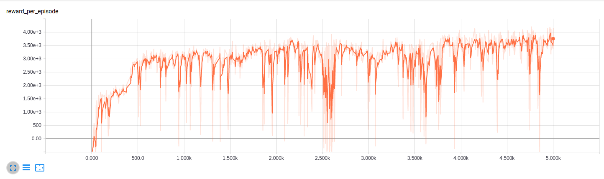

# Reinforcement Learning Models in PyTorch

## Description
This repo contans [PyTorch](https://www.pytorch.org/) implementations of reinforcement learning models for personal skill development. 

- [REINFORCE](http://www-anw.cs.umass.edu/~barto/courses/cs687/williams92simple.pdf)
- [Deep Deterministic Policy Gradient](https://arxiv.org/pdf/1509.02971.pdf)

## Background
REINFORCE is a policy gradient method that calculates the policy gradient at the end of every episode and updates the agents parameters accordingly. 

Deep Deterministic Policy Gradient (DDPG) is an off-policy, actor-critic policy gradient method. Similar to Deep Q-Learning, a target and current model are used for the actor (policy) and critic (value) functions, and the target model is gradually updated. DDPG also utilizes an experience replay buffer. Losses are computed from the temporal difference error signal.

## Dependencies

- Python 3.5.2
- [PyTorch 0.2.0](http://pytorch.org/)
- [NumPy](http://www.numpy.org/)
- [OpenAI Gym](https://github.com/openai/gym)
- [MuJoCo 1.5.0](http://www.mujoco.org/index.html)
- [Tensorboard](https://github.com/tensorflow/tensorboard)

## Results

### DDPG

Reward per episode on HalfCheetah-v1

    

Visualization of learned policy on HalfCheetah-v1

    

## Useful References
- [Policy gradient methods](http://www.scholarpedia.org/article/Policy_gradient_methods#Likelihood_Ratio_Methods_and_REINFORCE)
- [David Silver RL at UCL](http://www0.cs.ucl.ac.uk/staff/d.silver/web/Teaching.html)

